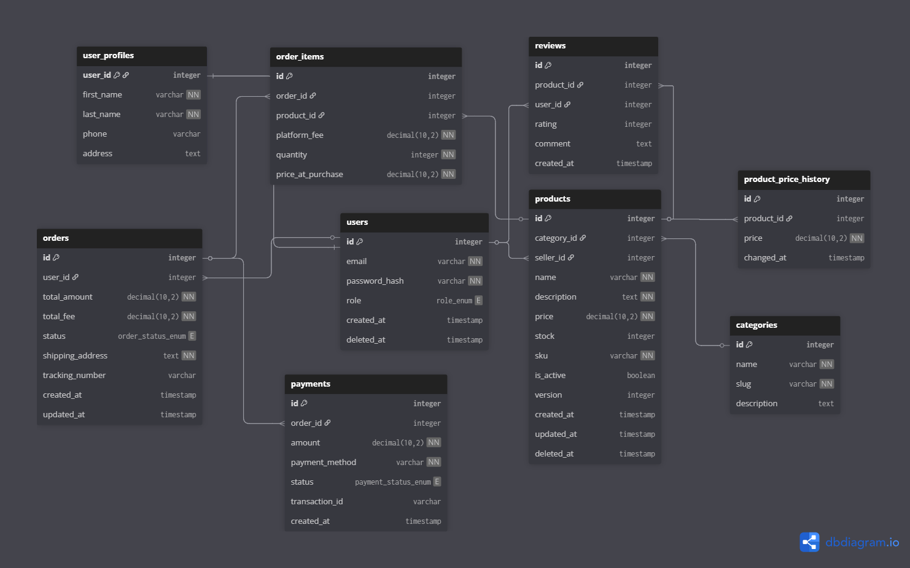

# **Лабораторна робота 1**

## 1. Вимоги для системи

### Вимоги до функціональності для Покупця (Buyer):

1. Система повинна надавати можливість реєстрації та входу з використанням електронної пошти та пароля. 
2. Система повинна дозволяти користувачеві заповнювати особистий профіль (ім'я, телефон, адреса доставки). 
3. Покупець повинен мати можливість переглядати товари, в тому числі за категоріями. 
4. Система повинна дозволяти оформлювати замовлення, додаючи товари у кошик та фіксуючи адресу доставки на момент покупки. 
5. Покупець повинен мати можливість оплачувати замовлення доступними методами (карта, готівка при отриманні тощо). 
6. Система має дозволяти залишати відгуки та оцінки (1-5) до придбаних товарів. 
7. Покупець повинен мати можливість повернути товар протягом 14 днів

### Вимоги до функціональності для Продавця (Seller):

1. Система повинна дозволяти продавцю створювати нові товари, вказуючи назву, опис, ціну, артикул (SKU) та початковий залишок на складі. 
2. Продавець повинен мати можливість керувати статусом товару (активний/неактивний) та оновлювати ціну (із збереженням історії змін). 
3. Система має забезпечувати механізм оптимістичного блокування при редагуванні товарів, щоб уникнути конфліктів даних. 
4. Продавець повинен бачити замовлення, що надійшли на його товари, та мати можливість додавати трекінговий номер для відправлених посилок.

### Вимоги до функціональності для Адміністратора (Admin):

1. Система повинна надавати можливість керувати категоріями товарів (створення, редагування). 
2. Адміністратор повинен мати можливість блокувати (видаляти через Soft Delete) користувачів або товари, що порушують правила. 
3. Система повинна автоматично розраховувати комісію платформи (platform fee) з кожного успішного замовлення. 
4. Адміністратор повинен мати доступ до історії цін товарів для аналітики.

## 2. Дані для зберігання

### 2.1 Сутності та атрибути

**User (Користувач)**
- ID (id)
- Email (email)
- Хеш пароля (password_hash)
- Роль (role)
- Дата реєстрації (created_at)
- Дата видалення (deleted_at - для Soft Delete)

**UserProfile (Профіль користувача)**
- ID користувача (user_id)
- Ім’я (first_name)
- Прізвище (last_name)
- Телефон (phone)
- Адреса (address)

**Category (Категорія)**
- ID (id)
- Назва (name)
- Slug (slug - унікальний ідентифікатор для URL)
- Опис (description)

**Product (Товар)**
- ID (id)
- Назва (name)
- Опис (description)
- Ціна (price)
- Залишок (stock)
- Артикул (sku)
- Активний (is_active)
- Версія (version - для Optimistic Locking)
- Дата останньої зміни (створення/оновлення/видалення)

**ProductPriceHistory (Історія цін)**
- ID (id)
- Ціна (price)
- Дата зміни (changed_at)

**Order (Замовлення)**
- ID (id)
- Загальна сума (total_amount)
- Загальна комісія(total_fee)
- Статус (status)
- Адреса доставки (shipping_address - знімок)
- Трекінговий номер (tracking_number)
- Дати створення/оновлення

**OrderItem (Позиція замовлення)**
- ID (id)
- Кількість (quantity)
- Комісія платформи (platform_fee)
- Ціна при покупці (price_at_purchase - знімок)

**Payment (Платіж)**
- ID (id)
- Сума (amount)
- Метод оплати (payment_method)
- Статус (status)
- ID транзакції (transaction_id)
- Дата створення

**Review (Відгук)**
- ID (id)
- Оцінка (rating)
- Коментар (comment)
- Дата створення

### 2.2 Таблиці з описом ключів та атрибутів

**users**
- id - PK, Serial 
- email - String, Unique, Not Null 
- password_hash - String, Not Null 
- role - Enum ('BUYER', 'SELLER', 'ADMIN'), Default 'BUYER' 
- created_at - Timestamp, Default Now 
- deleted_at - Timestamp, Nullable

**user_profiles** 
- user_id - PK, FK (to users.id), Unique 
- first_name - String, Not Null 
- last_name - String, Not Null 
- phone - String, Nullable 
- address - Text, Nullable

**categories** 
- id - PK, Serial 
- name - String, Not Null 
- slug - String, Unique, Not Null 
- description - Text, Nullable

**products**
- id - PK, Serial 
- category_id - FK (to categories.id)
- seller_id - FK (to users.id)
- name - String, Not Null 
- description - Text, Not Null 
- price - Decimal(10,2), Not Null 
- stock - Integer, Check(>=0)
- sku - String, Unique, Not Null 
- is_active - Boolean, Default true 
- version - Integer, Default 1 
- deleted_at - Timestamp, Nullable

**product_price_history**
- id - PK, Serial 
- product_id - FK (to products.id)
- price - Decimal(10,2), Not Null 
- changed_at - Timestamp, Default Now

**orders**
- id - PK, Serial 
- user_id - FK (to users.id)
- total_amount - Decimal(10,2), Not Null 
- total_fee - Decimal(10,2), Not Null 
- status - Enum ('PENDING', 'PAID', 'SHIPPED', 'CANCELLED', 'COMPLETED')
- shipping_address - Text, Not Null 
- tracking_number - String, Nullable 
- created_at - Timestamp

**order_items**
- id - PK, Serial 
- order_id - FK (to orders.id)
- product_id - FK (to products.id)
- platform_fee - Decimal(10,2), Not Null 
- quantity - Integer, Not Null 
- price_at_purchase - Decimal(10,2), Not Null

**payments**
- id - PK, Serial 
- order_id - FK (to orders.id)
- amount - Decimal(10,2), Not Null 
- payment_method - String, Not Null 
- status - Enum ('PENDING', 'SUCCESS', 'FAILED')
- transaction_id - String, Nullable 
- created_at - Timestamp

**reviews**
- id - PK, Serial 
- product_id - FK (to products.id)
- user_id - FK (to users.id)
- rating - Integer, Not Null, Check (1-5)
- comment - Text, Nullable 
- created_at - Timestamp

### 2.3 Зв’язки
Users - UserProfiles (1:1): Кожен користувач має рівно один профіль з додатковою інформацією.

Users - Products (1:N): Один користувач (в ролі Продавця) може створити багато товарів. Кожен товар належить одному продавцю.

Categories - Products (1:N): Одна категорія може містити багато товарів. Товар належить одній категорії.

Products - ProductPriceHistory (1:N): Один товар може мати багато записів в історії зміни цін.

Users - Orders (1:N): Один користувач (Покупець) може зробити багато замовлень. Замовлення належить одному користувачу.

Orders - OrderItems (1:N): Одне замовлення складається з багатьох позицій (товарів).

Products - OrderItems (1:N): Один товар може бути частиною багатьох різних замовлень (через таблицю OrderItems).

Orders - Payments (1:N): Замовлення може мати кілька спроб оплати (платежів), але кожен платіж стосується одного замовлення.

Users - Reviews (1:N): Користувач може залишити багато відгуків.

Products - Reviews (1:N): Товар може мати багато відгуків від різних користувачів.

## 3.Бізнес-правила та Припущення
ізнес-правила та Припущення
1. Унікальність даних: Email користувача, SKU товару та Slug категорії повинні бути унікальними в системі. 
2. Soft Delete: Видалення користувачів або товарів не призводить до їх фізичного знищення з бази даних (для збереження історії замовлень), а лише встановлює мітку часу в полі deleted_at. 
3. Фіксація цін (Snapshotting): При створенні замовлення ціна товару фіксується в order_items. Подальша зміна ціни товару продавцем не впливає на вже створені замовлення. 
4. Фіксація адреси: Адреса доставки копіюється в замовлення (orders.shipping_address) на момент покупки. Зміна адреси в профілі користувача не змінює адресу в історичних замовленнях. 
5. Залишки на складі: Кількість товару (stock) не може бути від'ємною. При створенні замовлення відповідна кількість резервується/списується. 
6. Рейтинг: Оцінка у відгуку може бути лише цілим числом від 1 до 5. 
7. Оптимістичне блокування: Поле version у товарах використовується для запобігання перезапису змін, якщо два продавці (або процеси) редагують товар одночасно.

 
