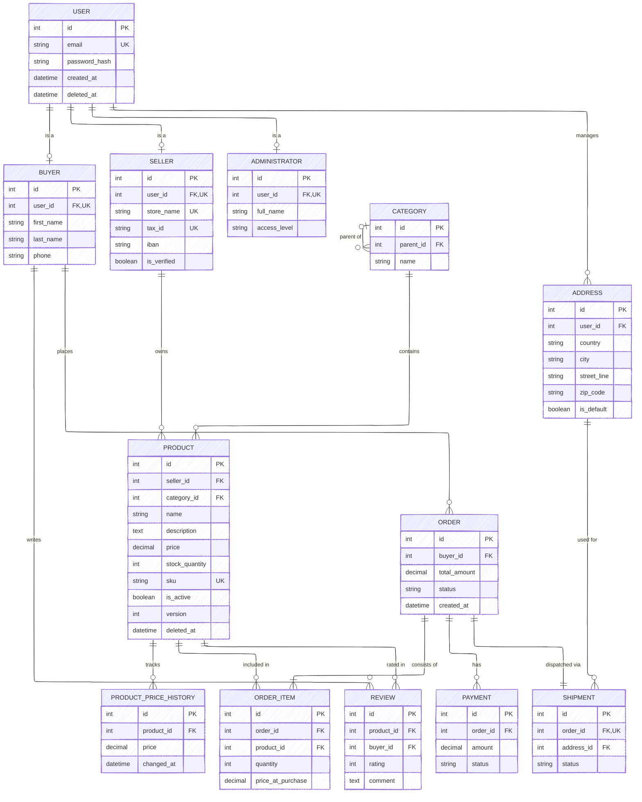

# **Лабораторна робота 1: Збір вимог та розробка ER-діаграми**

## 1. Вимоги для системи

### 1.1 Дані для зберігання

Система повинна зберігати інформацію про наступні об'єкти предметної області:

* **Користувачі:** Базова інформація для авторизації, спільна для всіх ролей (покупці, продавці, адміністратори).
* **Профілі покупців:** Персональні дані (ім'я, контакти), необхідні для оформлення замовлень.
* **Профілі продавців:** Бізнес-дані (магазин, податковий номер, рейтинг) для ведення торгівлі.
* **Адміністратори:** Дані про співробітників платформи та їх рівні доступу.
* **Адреси:** Збережені адреси користувачів для швидкого оформлення доставки.
* **Категорії:** Ієрархічна структура для класифікації товарів.
* **Товари:** Інформація про продукти, їх ціни, артикули, описи та поточний стан.
* **Історія цін:** Хронологія змін вартості товарів.
* **Замовлення:** Інформація про транзакції, включаючи статус, суму та знімок адреси доставки.
* **Позиції замовлення:** Деталізація вмісту кожного замовлення (товари та їх кількість).
* **Платежі:** Статус та деталі фінансових транзакцій.
* **Відгуки:** Оцінки та коментарі користувачів щодо товарів.

### 1.2 Бізнес-правила (Функціональні вимоги)

1. **Єдина авторизація:** Всі користувачі (Покупець, Продавець, Адмін) входять у систему через єдину сутність `User` (email + password).
2. **Рольова модель:** Кожен користувач має певну роль, яка визначає наявність відповідного профілю (Buyer, Seller або Admin).
3. **Soft Delete:** Видалення користувачів або товарів не призводить до фізичного знищення записів у БД. Замість цього встановлюється мітка часу видалення (`deleted_at`), що робить запис неактивним, але зберігає історію.
4. **Управління адресами:** Покупець може зберігати кілька адрес у профілі. При оформленні замовлення він може вибрати збережену адресу або ввести нову (кастомну).
5. **Фіксація адреси (Snapshot):** Адреса доставки копіюється в замовлення як текстовий знімок на момент покупки. Зміна або видалення адреси у профілі не впливає на історичні замовлення.
6. **Пошук та Вітрина:** Система забезпечує пошук товарів та публічний доступ до каталогу для незареєстрованих користувачів.
7. **Верифікація продавця:** Товари продавця стають доступними для покупки тільки після підтвердження його профілю адміністратором.
8. **Складський облік:** При замовленні кількість товару резервується. Якщо залишок досягає 0, товар приховується з продажу.
9. **Оптимістичне блокування:** Редагування товару захищене версійністю (`version`), щоб уникнути конфліктів при одночасному доступі.
10. **Фіксація цін:** Ціна товару фіксується в момент створення замовлення. Подальші зміни ціни продавцем не впливають на існуючі замовлення.
11. **Відгуки:** Залишати відгуки можуть лише покупці, які фактично придбали цей товар.

## 2. Сутності та атрибути

**User (Користувач)**

* `id`: (PK) — Унікальний автоінкрементний ідентифікатор.
* `email`: (Unique, Not Null) — Логін користувача.
* `password_hash`: (Not Null) — Хеш пароля.
* `created_at` — Дата реєстрації.
* `deleted_at`: (Nullable) — Дата логічного видалення.

**Buyer (Профіль Покупця)**

* `id`: (PK) — Унікальний ідентифікатор профілю.
* `user_id`: (FK -> User.id, Unique, Not Null) — Посилання на обліковий запис.
* `first_name`: (Not Null) — Ім’я.
* `last_name`: (Not Null) — Прізвище.
* `phone`: (Nullable) — Контактний телефон.

**Seller (Профіль Продавця)**

* `id`: (PK) — Унікальний ідентифікатор профілю.
* `user_id`: (FK -> User.id, Unique, Not Null) — Посилання на обліковий запис.
* `store_name`: (Unique, Not Null) — Назва магазину.
* `tax_id`: (Unique, Not Null) — Податковий номер (ЄДРПОУ/ІПН).
* `iban`: (Not Null) — Банківський рахунок.
* `is_verified` — Статус перевірки адміністратором.

**Administrator (Профіль Адміна)**

* `id`: (PK) — Унікальний ідентифікатор профілю.
* `user_id`: (FK -> User.id, Unique, Not Null) — Посилання на обліковий запис.
* `full_name`: (Not Null) — ПІБ співробітника.
* `access_level`: (Check IN ('SUPER', 'MODERATOR')) — Рівень доступу.

**Address (Збережена адреса)**

* `id`: (PK) — Ідентифікатор запису.
* `user_id`: (FK -> User.id, Not Null) — Власник адреси.
* `country`: (Not Null) — Країна.
* `city`: (Not Null) — Місто.
* `street_line`: (Not Null) — Вулиця, будинок, квартира.
* `zip_code`: (Not Null) — Поштовий індекс.
* `is_default` — Чи є основною адресою.

**Category (Категорія)**

* `id`: (PK) — Ідентифікатор категорії.
* `parent_id`: (FK -> Category.id, Nullable) — Батьківська категорія.
* `name`: (Not Null) — Назва категорії.

**Product (Товар)**

* `id`: (PK) — Ідентифікатор товару.
* `seller_id`: (FK -> Seller.id, Not Null) — Власник товару.
* `category_id`: (FK -> Category.id, Not Null) — Категорія.
* `name`: (Not Null) — Назва товару.
* `description`: (Nullable) — Детальний опис.
* `price`: (Not Null, Check > 0) — Поточна ціна.
* `stock_quantity`: (Not Null, Check >= 0) — Залишок на складі.
* `sku`: (Unique, Not Null) — Унікальний артикул.
* `is_active` — Чи відображається товар.
* `version` — Версія для оптимістичного блокування.
* `deleted_at`: (Nullable) — Дата логічного видалення.

**ProductPriceHistory (Історія цін)**

* `id`: (PK) — Ідентифікатор запису.
* `product_id`: (FK -> Product.id, Not Null) — Товар.
* `price`: (Not Null) — Ціна на момент запису.
* `changed_at` — Дата зміни.

**Order (Замовлення)**

* `id`: (PK) — Ідентифікатор замовлення.
* `buyer_id`: (FK -> Buyer.id, Not Null) — Замовник.
* `total_amount`: (Not Null) — Загальна сума замовлення.
* `status`: (Check IN ('PENDING', 'PAID', 'SHIPPED', 'DELIVERED', 'CANCELLED')) — Статус.
* `created_at` — Дата створення.

**OrderItem (Позиція)**

* `id`: (PK) — Ідентифікатор позиції.
* `order_id`: (FK -> Order.id, Not Null) — Замовлення.
* `product_id`: (FK -> Product.id, Not Null) — Товар.
* `quantity`: (Not Null, Check > 0) — Кількість товару.
* `price_at_purchase`: (Not Null) — Ціна за одиницю на момент покупки.

**Payment (Платіж)**

* `id`: (PK) — Ідентифікатор платежу.
* `order_id`: (FK -> Order.id, Not Null) — Замовлення.
* `amount`: (Not Null) — Сума транзакції.
* `status`: (Check IN ('PENDING', 'SUCCESS', 'FAILED')) — Статус оплати.

**Shipment (Доставка)**

* `id`: (PK) — Ідентифікатор доставки.
* `order_id`: (FK -> Order.id, Not Null, Unique) — Замовлення.
* `address_id`: (FK -> Address.id) - адреса доставки на момент створення замовлення.
* `status`: (Check IN ('PENDING', 'SHIPPED', 'DELIVERED'', 'FAILED')) — Статус оплати.

**Review (Відгук)**

* `id`: (PK) — Ідентифікатор відгуку.
* `product_id`: (FK -> Product.id, Not Null) — Товар.
* `buyer_id`: (FK -> Buyer.id, Not Null) — Автор відгуку.
* `rating`: (Not Null, Check BETWEEN 1 AND 5) — Оцінка.
* `comment`: (Nullable) — Текст відгуку.

## 3. Зв'язки між сутностями

1. **User - Profiles (1:1):** `User` має зв'язок "один-до-одного" з однією з таблиць профілів (`Buyer`, `Seller`, `Administrator`) залежно від ролі.
2. **User - Addresses (1:N):** Користувач (зазвичай покупець) може мати багато збережених адрес у книзі адрес.
3. **Seller - Products (1:N):** Продавець володіє багатьма товарами.
4. **Category - Category (1:N):** Рекурсивний зв'язок для побудови дерева категорій.
5. **Buyer - Orders (1:N):** Покупець створює багато замовлень.
6. **Order - OrderItems (1:N):** Замовлення містить список товарів.
7. **Product - OrderItems (1:N):** Товар може бути частиною багатьох замовлень.
8. **Order - Payment (1:N):** Замовлення може мати спроби оплати (хоча успішна зазвичай одна).
9. **Order - Shipment (1:1):** Замовлення може мати лише одну доставку.
10. **Buyer - Review (1:N):** Покупець пише відгуки.
11. **Product - Review (1:N):** Товар має список відгуків.

## 4. Припущення та обмеження

1. **Унікальність Email:** Email є унікальним індексом у таблиці `User`, що гарантує неможливість реєстрації дублікатів.
2. **Soft Delete:** Фізичне видалення записів з бази даних заборонено для сутностей `User` та `Product`. Використовується логічне видалення через поле `deleted_at`.
3. **Оптимістичне блокування:** Поле `version` у `Product` збільшується на 1 при кожному оновленні. Перед записом система перевіряє, чи версія в БД збігається з версією, яку отримав користувач перед початком редагування.
4. **Фіксована ціна**: Ціна товару фіксуються на момент оформлення замовлення, що захищає від змін цін після оформлення замовлення.

## 5. ER діаграма

