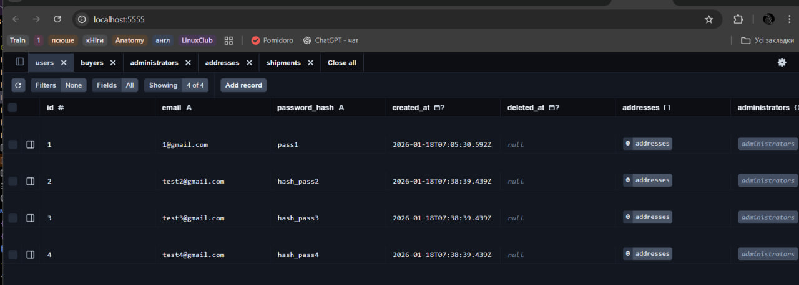

# Migrations Report (Lab 6)

## 1. Ініціалізація (Introspection & Init)

**Команда:** `npx prisma db pull`

**Опис:**
Схему було зчитано з існуючої бази даних PostgreSQL (результат Lab 5). Це створило базовий файл `schema.prisma` з моделями `users`, `buyers`, `sellers`, `products`, `orders` та іншими.

---

## 2. Міграція: Додавання таблиці Wishlist (`add_wishlists_table`)

**Команда:** `npx prisma migrate dev --name add_wishlists_table`

**Опис:**
Додано нову сутність **wishlists** для зберігання списку бажань покупців. Реалізовано зв'язок "багато-до-одного" з таблицями `buyers` та `products`.

### Зміни в `schema.prisma`:

**До:**
*(Таблиця відсутня)*

**Після:**

```prisma
model wishlists {
  id         Int      @id @default(autoincrement())
  buyer_id   Int
  product_id Int
  created_at DateTime @default(now())
  buyer      buyers   @relation(fields: [buyer_id], references: [id])
  product    products @relation(fields: [product_id], references: [id])

  @@unique([buyer_id, product_id])
}

// Оновлено модель buyers
model buyers {
  // ...
  wishlists  wishlists[]
}

// Оновлено модель products
model products {
  // ...
  wishlists  wishlists[]
}
```

---

## 3. Міграція: Зміна існуючої таблиці (`add_rewiews_likes`)

**Команда:** `npx prisma migrate dev --name add_rewiews_likes`

**Опис:**
До таблиці відгуків (`reviews`) додано поле `likes` (тип `Int`) для підрахунку кількості вподобань відгуку іншими користувачами. Встановлено значення за замовчуванням `0`.

### Зміни в `schema.prisma`:

**До:**

```prisma
model reviews {
  id         Int       @id @default(autoincrement())
  // ...
  comment    String?
  created_at DateTime? @default(now()) @db.Timestamp(6)
  // ...
}
```

**Після:**

```prisma
model reviews {
  id         Int       @id @default(autoincrement())
  // ...
  comment    String?
  likes      Int       @default(0) // <-- Додане поле
  created_at DateTime? @default(now()) @db.Timestamp(6)
  // ...
}
```

---

## 4. Міграція: Видалення стовпця (`drop_products_column`)

**Команда:** `npx prisma migrate dev --name drop_products_column`

**Опис:**
З таблиці `products` видалено поле `description` (опис товару). Це імітує зміну вимог, де опис може бути перенесено в іншу таблицю або видалено за непотрібністю в основній таблиці.

### Зміни в `schema.prisma`:

**До:**

```prisma
model products {
  id             Int      @id @default(autoincrement())
  name           String   @db.VarChar(200)
  description    String?  // <-- Це поле існувало
  price          Decimal  @db.Decimal(10, 2)
  // ...
}
```

**Після:**

```prisma
model products {
  id             Int      @id @default(autoincrement())
  name           String   @db.VarChar(200)
  // description видалено
  price          Decimal  @db.Decimal(10, 2)
  // ...
}
```

---

## 5. Перевірка результатів (npx prisma studio)

Об'єкти успішно створюються та відображаються у веб версії prisma studio
